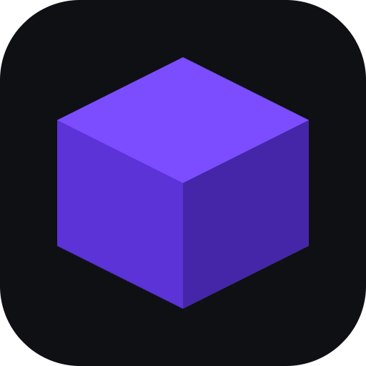
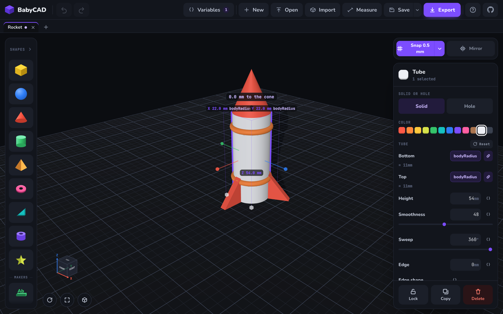

<div align="center">



# BabyCAD

**3D modelling for kids, in the browser.** Drop shapes on a 400 mm plate, give
them real millimetres, and take the result away as an STL you can print.

[**Open BabyCAD →**](https://theanam.github.io/babycad/)

No account. No cloud. Nothing you build ever leaves your device.



</div>

## What it is

Most CAD is built for people who already know CAD. BabyCAD is for a child who
wants a thing — a name tag, a phone stand, a die with real pips — and a printer
in the corner of the room.

It is a real modelling tool underneath. Everything is in millimetres, every
shape keeps its own numbers rather than a scale multiplier, and what comes out
is a solid mesh a slicer will accept. It is only the *way in* that is simple.

- **Shapes with numbers, not just handles.** Drag a cube wider and its Width
  says 30 mm. Type 30 mm and it does the same thing. A tube has a radius, a
  gear has teeth and a module, a screw has a pitch.
- **Holes that cut.** Mark any block as a hole and it takes its own volume out
  of whatever it overlaps — a tray, a bore, the pips on a die.
- **Variables.** Point several numbers at one variable and drag it; everything
  that follows it moves together.
- **Copy and paste that travels.** Blocks go on the real clipboard — with the
  combines they're in, the variables they follow and, for an imported part, its
  triangles — so they paste into another build, another window, or a message to
  somebody who pastes them straight back onto a plate.
- **Rounded and bevelled edges**, because a printed part with a softened edge
  is a nicer object than one with a knife edge.
- **Line up and flip.** Align brings a set of blocks' faces together; Mirror
  turns one block or a whole selection over, and exports the right way out.
- **Lock what's finished**, and Align brings everything else to it.
- **A tape measure**: press two points and read the distance.
- **Words as solids.** Type them, pick a typeface — two bundled, a dozen more
  from Google Fonts — and they come out as raised lettering.
- **Bring your own models.** Import an STL, OBJ or 3MF and build around it.
- **Take it away.** STL for printing, glTF for everything else. Builds are
  ordinary files you keep wherever you like.

## Getting around

| | |
|---|---|
| Pick a block | click it — Shift-click to add, or drag a box over empty plate |
| Copy it | Ctrl/⌘ + C, then V — blocks paste into any build, or any other window |
| Move it | drag the block itself along the floor |
| Lift it | drag the cone above the box |
| Resize it | drag a corner handle, or type a size straight onto the box |
| Turn it | swing one of the coloured balls, or type an angle onto the dial it leaves |
| Flip it | switch on **Mirror** and tap an arrow plate — works on one block or many |
| Hold it still | the padlock in the panel — Align then brings others to it |
| Measure | **Measure** in the top bar, then press two places |
| Turn the view | right-drag |
| Slide the view | middle-drag, or Shift + right-drag |
| Zoom | scroll — on a touchscreen, one finger turns and two pinch and slide |

There is a **How this works** sheet inside the app with the rest of it.

## Running it yourself

```bash
npm install
npm run dev       # http://localhost:5180
npm run build     # a static bundle in dist/
npm run check     # every shape, resize, example, hole and alignment
```

There is no backend to stand up and nothing to configure. `npm run build`
produces a folder of static files that will sit behind any web server.

## Contributing

Bug reports and ideas are welcome — [open an
issue](https://github.com/theanam/babycad/issues).

If you are changing the code, two things are worth knowing:

- **`npm run check` is the safety net.** It builds every shape across its whole
  parameter range, checks the meshes are solid and wound outward, and rebuilds
  every example. Several of those checks exist because something shipped broken
  once; please add one when you fix something a picture would have caught.
- **[docs/architecture.md](docs/architecture.md)** explains how the pieces fit:
  the shape registry, the geometry cache, variables, and how a drag becomes a
  change to a shape's own numbers.

## Licence

No licence has been chosen for the source yet, so default copyright applies —
if you want to reuse it, ask.

The bundled typefaces are three.js's MgOpen-derived faces and carry their own
permissive licence, which travels with them in
[`src/shapes/fonts/LICENSE`](src/shapes/fonts/LICENSE). The rest are fetched
from the [google/fonts](https://github.com/google/fonts) repository at the
moment you pick them, and are covered by their own licences there — mostly the
SIL Open Font Licence.
